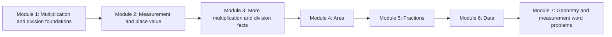

# Grade 3 Eureka Math Interactive App Workspace

This workspace contains the Grade 3 Eureka Math source PDFs, planning docs, and the local Angular app for building interactive module-by-module and lesson-by-lesson learning experiences.

## Workspace Root

```text
/Volumes/Data2/Tutorials/Eureka Math Grade 2 - Syllabus Videos Curriculum/Grade3
```

## What Is In This Workspace

| Path | Purpose |
| --- | --- |
| `EurekaMath-Sources/` | Source PDFs. Teacher editions are the curriculum source of truth. |
| `interactive-grade3-app/` | Local Angular app implementation. |
| `docs/interactive-grade3/` | Requirements, design spec, implementation plan, source audits, delivery audits, and task tracking. |
| `tmp/` | Temporary extraction/render outputs and the original chat transcript used only for tone/workflow guidance. |

## Source Of Truth

Curriculum facts, module structure, topic names, lesson objectives, examples, and validation logic must come from the Eureka Math Grade 3 teacher editions:

```text
EurekaMath-Sources/Module_1/g3_m1_teacher_edition_v1_3_1.pdf
EurekaMath-Sources/Module_2/g3_m2_teacher_edition_v1_3_0.pdf
EurekaMath-Sources/Module_3/g3_m3_teacher_edition_v1_3_0.pdf
EurekaMath-Sources/Module_4/g3_m4_teacher_edition_v1_3_0.pdf
EurekaMath-Sources/Module_5/g3_m5_teacher_edition_v1_3_0.pdf
EurekaMath-Sources/Module_6/g3_m6_teacher_edition_v1_3_0.pdf
EurekaMath-Sources/Module_7/g3_m7_teacher_edition_v1_3_1.pdf
```

Student workbooks and additional materials can support practice only after the teacher-edition lesson sequence is established.

`tmp/req.txt` is not curriculum truth. It is only pacing, tone, and workflow guidance.

## Reference Projects

These projects are read-only references for architecture, visual components, and design patterns:

```text
/Volumes/Data/EdZillaPrj/EdZilla/edzilla-gtm/
/Volumes/Data/EdZillaPrj/EdZilla/scratch-prjs/design-spec/
```

Do not edit those reference projects for this work.

## App

The app lives here:

```text
interactive-grade3-app/
```

Run locally:

```bash
scripts/grade3_app_start.sh
```

Open:

```text
http://localhost:4220/ruchika-grade3/
```

Stop/status/context:

```bash
scripts/grade3_app_start.sh stop
scripts/grade3_app_start.sh status
scripts/grade3_app_start.sh context
```

The script stops any existing listener on port `4220`, restarts the Angular app in a detached `screen` session, writes logs to `tmp/logs/grade3-app-latest.log`, and writes run context to `tmp/grade3-app-context-latest.txt`.

Build:

```bash
cd interactive-grade3-app
npm run build
```

## Current Delivered Scope

- Angular app inside this Grade3 workspace.
- Separate module pages for Modules 1-7.
- Source-backed module/topic/lesson maps.
- All 152 Grade 3 lesson routes populated.
- Collapsible left curriculum drawer with expandable module sections and lesson links.
- Every lesson route uses the teacher-edition overview objective, module topic, module visual models, and source page references.
- Module 1 Lesson 1 fully authored as the deepest interactive lesson.
- Lesson flows split into small screens, not a few large panels.
- Equal-groups visual model and generic model panels for other source-backed lesson flows.
- Answer validation and feedback for the fully authored Lesson 1 flow; objective-check feedback for generated lesson flows.
- Source and delivery audit docs.

## Curriculum Flow



## Key Docs

| Doc | Purpose |
| --- | --- |
| `docs/interactive-grade3/requirements.md` | Product/content requirements. |
| `docs/interactive-grade3/design-spec.md` | UI and interaction design requirements. |
| `docs/interactive-grade3/implementation-plan.md` | Technical implementation plan. |
| `docs/interactive-grade3/curriculum-source-spec.md` | Rules for extracting and using source content. |
| `docs/interactive-grade3/source-audit.md` | Source alignment audit. |
| `docs/interactive-grade3/requirements-delivery-audit.md` | Content/design delivery audit. |
| `docs/interactive-grade3/task-tracker.md` | Task status, decisions, validation log. |
| `docs/interactive-grade3/worktree-and-operations.md` | Local operating rules. |

## Operating Rules

- Keep implementation work inside this Grade3 workspace.
- Do not alter the EdZilla reference projects.
- Do not invent lesson content.
- Keep generated lesson flows tied to teacher-edition objectives and module models.
- Before deep-authoring a lesson beyond the objective flow, extract and audit the teacher-edition lesson pages.
- Keep lesson screens small and visual.
- Run `npm run build` after app changes.
- Browser/screenshot QA requires explicit authorization for the local app target.
